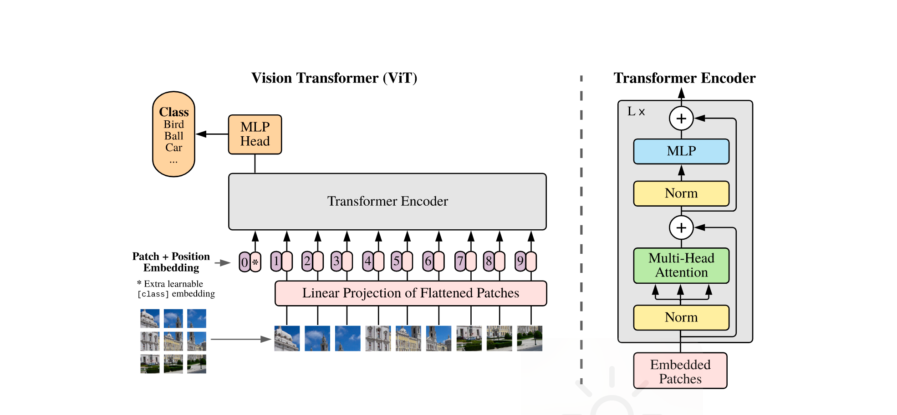
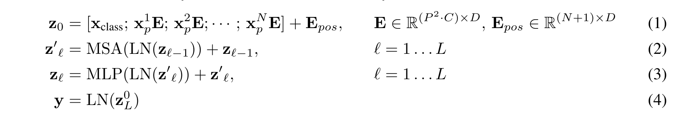
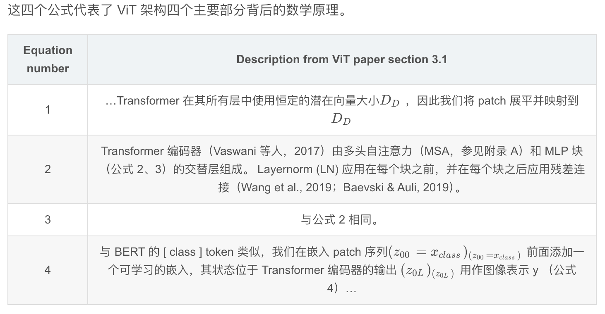
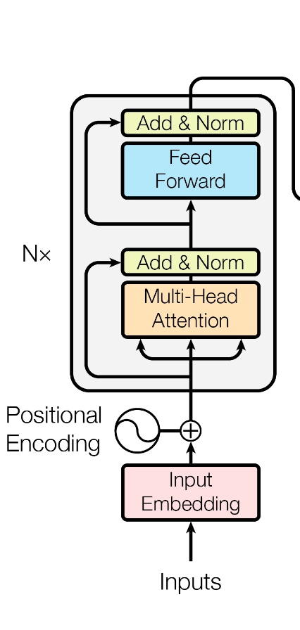
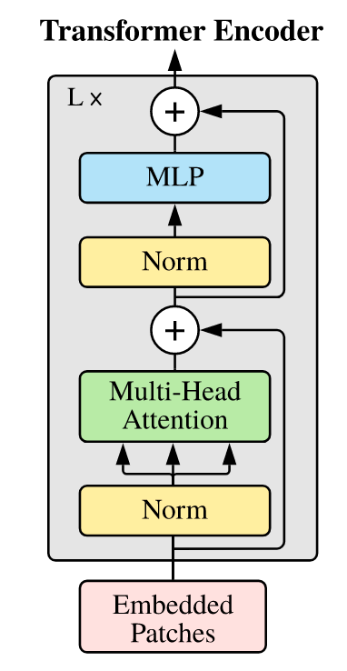
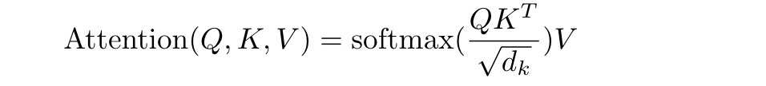
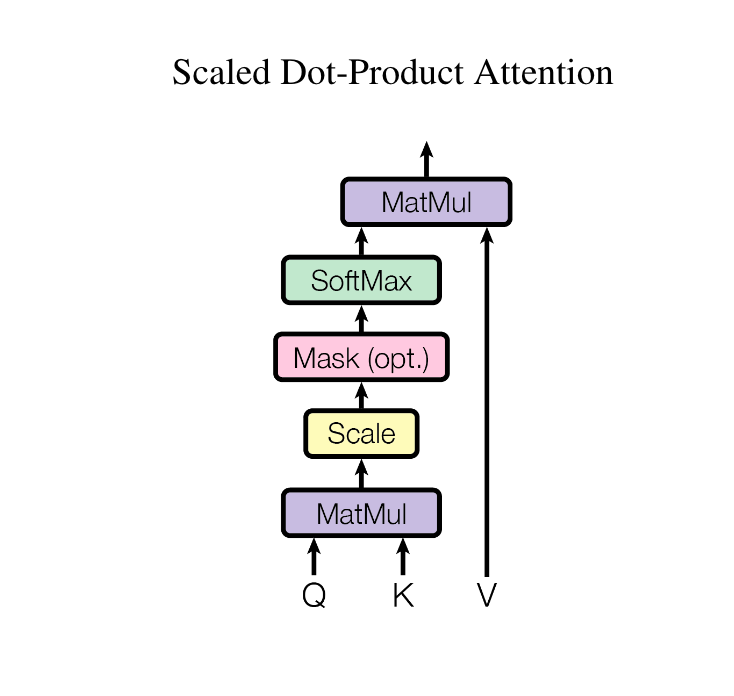
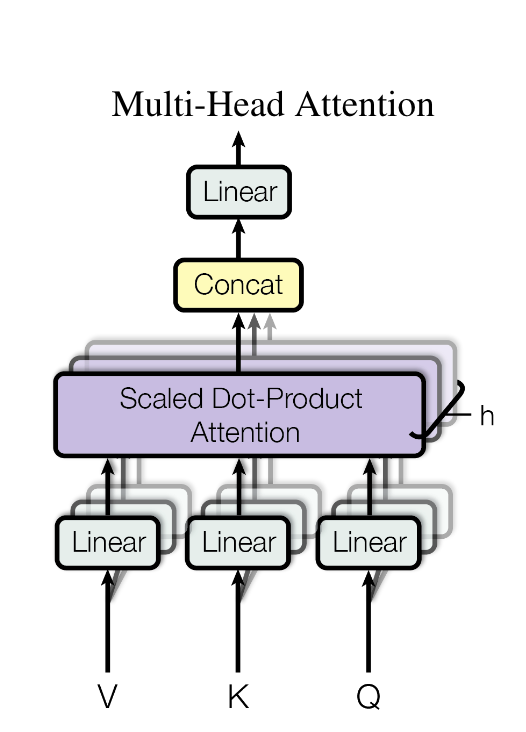
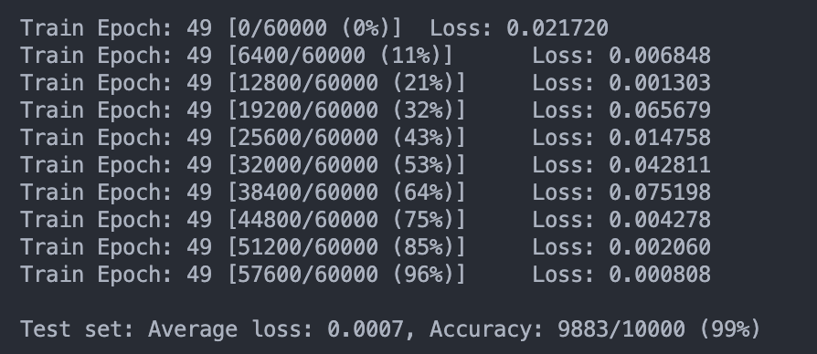

# VIT实验报告
## 1. 实验目的
1. 了解VIT的基本原理、网络结构
2. 使用VIT模型在MNIST数据集上进行训练和测试

## 2. 实验环境
```shell
- cuda 12.1
- Nvidia Geforce RTX 3090
- torch 2.2.2
- torchaudio 2.2.2
- torchvision 0.17.2
- python 3.9.19
```

## 3. 实验原理
参考论文：[An Image is Worth 16x16 Words: Transformers for Image Recognition at Scale](https://arxiv.org/abs/2010.11929)

VIT模型是一种基于Transformer的视觉模型，它将图像分割成固定大小的图块，然后将这些图块展平并添加位置编码，然后将这些向量序列输入到Transformer中。VIT模型的结构如下图所示：


主要公式如下：




VIT主要由以下几个阶段构成：
1. Patch +  Positional Embedding：将图像分割成固定大小的图块，然后将这些图块展平并添加位置编码。
原始的图片输入是一个大小为H×W×C的图片，我们将其分割成N个大小为P×P×C的图块 **(patch)**，然后将这些图块展平成大小为N×(P×P×C)的向量序列。Transformer每一层都使用D维的嵌入，因此这输入的N×(P×P×C)的向量序列需要需要经过一个Liner Projection（图中Liner Projection of Flattened Patches）将其**映射到D维的向量序列**。（使用嵌入而不是直接使用原始像素值的原因是嵌入可以更好地捕捉图像的语义信息并且可学习）
与 BERT 的 [class] 标记类似，我们把**class token**加入到序列的开头，在此之后为了使Transformer能够感知到图像的全局位置信息，我们需要为每个位置添加**位置编码**，然后将位置编码加到每个位置的向量上，这样我们就得到了一个大小为(N+1)×D的向量序列。
>在原文中使用的位置编码是通过可学习的参数来实现的，而在Attention is All You Need中使用的是固定的位置编码。
2. Transformer Encoder：将向量序列输入到Transformer中。这部分结构类似原始的Transformer结构，最主要的部分是**多头自注意力机制(MSA)**，具体部分会在下一个模块详细介绍。

<p align="center">
  
  V.S.
  
</p>
3. MLP Head：最后将Transformer的输出通过一个MLP层，然后通过一个线性层输出最终的分类结果。   

## 4. 实验步骤
### 4.1 VIT网络模块
#### 4.1.1 Patch +  Positional Embedding
```python
class PatchEmbedded(nn.Module):
    def __init__(self, img_size=28, channels=1, patch_size=7, embed_dim=128):
        """
        img_size: 28
        channels: 1
        patch_size: 7

        """
        super().__init__()
        #self.nunum_batches = num_batches
        self.img_size = img_size
        self.channels = channels
        self.patch_size = patch_size
        self.embed_dim = embed_dim

        patch_dim = patch_size ** 2 * channels
        num_patches = (img_size // patch_size) ** 2

        self.embedding = nn.Linear(patch_dim, embed_dim)
        self.cls_token = nn.Parameter(torch.randn(1, 1, self.embed_dim))
        self.position_embedding = nn.Parameter(torch.randn(1, 1 + num_patches, embed_dim))

        #b, n=h*w/p^2, p^2*c


    def forward(self, x):
        #print(x.shape) #64 1 28 28
        x = rearrange(x, "b c (h h1) (w w1) -> b (h w) (c h1 w1)", h1 = self.patch_size, w1 = self.patch_size) #分割成n个patch
        #print("x after rearrange: ", x.shape) #b n c*p*p
        x = self.embedding(x) #b, n, d_model  Liner Projection
        #添加cls token
        cls_token = self.cls_token.expand(x.size(0), -1, -1) 
        x = torch.cat((cls_token, x), dim=1) #b, n+1, d_model
        x = x + self.position_embedding
        #print(x.shape)  64, 17, 128
        return x
```
这一部分在前面的模块已经有详细的讲解，不再赘述

#### 4.1.2 Transformer Encoder

##### MSA
这部分主要对映了equation2的部分，MultiHeadAttention模块的主要架构以及原理如下：

Attention模块的主要架构以及原理如下：



```python
def attention(query, key, value): #最后两个维度是长度与维度
    d_k = key.shape[-1]
    scores = torch.matmul(query, key.transpose(-2, -1))
    scores = scores / (d_k ** 0.5)

    return torch.matmul(F.softmax(scores, dim=-1), value)
```



```python
class MultiHeadAttention(nn.Module):
    def __init__(self, d_model, num_heads):
        super().__init__()
        self.d_model = d_model
        self.num_heads = num_heads
        assert d_model % num_heads == 0
        self.d_k = d_model // num_heads

        self.w_query = nn.Linear(d_model, d_model)
        self.w_key = nn.Linear(d_model, d_model)
        self.w_value = nn.Linear(d_model, d_model)

        self.fc_out = nn.Linear(d_model, d_model)
        


    def forward(self, x):
        # x = x.view(x.size(0), -1, self.num_heads, self.d_k).transpose(1, 2) 
        #b, len, d_model ->b, len, h, d//h->b,h,len,d//h
        #print(x.shape) 64 8 17 16
        query = self.w_query(x)
        key = self.w_key(x)
        value = self.w_value(x)

        query = query.view(query.size(0), -1, self.num_heads, self.d_k).transpose(1, 2)
        key = key.view(key.size(0), -1, self.num_heads, self.d_k).transpose(1, 2)
        value = value.view(key.size(0), -1, self.num_heads, self.d_k).transpose(1, 2)


        atten = attention(query, key, value) #b,h,len,d//h
        atten = atten.transpose(1, 2).contiguous().view(x.size(0), -1, self.num_heads * self.d_k)
        
        return self.fc_out(atten) #b,h,d
```

##### MLP
这部分包含了equation3的部分，由线性层-GELU-Dropout-线性层-Dropout组成
```python
class MLPBlock(nn.Module):
    def __init__(self, d_model, d_liner, drop_prob):
        super().__init__()
        self.net = nn.Sequential(
            nn.Linear(d_model, d_liner),
            nn.GELU(),
            nn.Dropout(drop_prob),
            nn.Linear(d_liner, d_model),
            nn.Dropout(drop_prob)
        )
    def forward(self, x):
        return self.net(x)
```

##### Encoder Block
把MSA与MLP打包起来，加上了LayerNorm和残差连接
```python
class EncoderBlock(nn.Module):
    def __init__(self, d_model, d_liner, num_heads, drop_prob):
        super().__init__()
        self.LayerNorm1 = nn.LayerNorm(d_model)
        self.atten = MultiHeadAttention(d_model, num_heads)
        self.drop_out2 = nn.Dropout(drop_prob)
        self.LayerNorm2 = nn.LayerNorm(d_model)
        self.mlp = MLPBlock(d_model, d_liner, drop_prob)
        self.drop_out1 = nn.Dropout(drop_prob)

    def forward(self, x):
        x = x + self.sub_layer1(x) #MSA部分与残差链接
        x = x + self.sub_layer2(x) #MLP部分与残差链接
        return x


    def sub_layer1(self, x):
        x = self.LayerNorm1(x)
        x = self.atten(x)
        x = self.drop_out1(x)
        return x
    def sub_layer2(self, x):
        x = self.LayerNorm2(x)
        x = self.mlp(x)
        x = self.drop_out2(x)
        return x
```
---

##### Transformer Encoder
把前面实现的EncoderBlock堆叠num_blocks次
```python
class TransformerEncoder(nn.Module):
    def __init__(self, num_blocks, d_model, d_liner, num_heads, drop_prob):
        super().__init__()
        self.num_blocks = num_blocks
        self.layers = nn.ModuleList(
            [EncoderBlock(d_model, d_liner, num_heads, drop_prob) for _ in range(num_blocks)]
        )

    def forward(self, x):
        for layer in self.layers:
            x = layer(x)
        #print(x.shape)
        return x
```

#### 4.1.3 MLP Head
就是一个简单的线性层，把Transformer的输出映射到类别数，注意，这里的输出是一个序列，我们只需要cls token的输出，其维度为d_model，因此这个线性层是d_model到类别数的映射


#### 4.1.4 VIT整体
```python
class VIT(nn.Module):
    def __init__(self, num_blocks, d_model, d_liner, num_heads, drop_prob, img_size, channels, patch_size, num_classes):
        super().__init__()
        self.patch_embedding = PatchEmbedded(img_size, channels, patch_size, d_model)
        self.dropout = nn.Dropout(drop_prob)
        self.encoder = TransformerEncoder(num_blocks, d_model, d_liner, num_heads, drop_prob)
        self.ln = nn.LayerNorm(d_model)
        self.mlp_head = nn.Linear(d_model, num_classes) #MLP Head

    def forward(self, x):
        x = self.patch_embedding(x)
        x = self.dropout(x)
        x = self.encoder(x)
        x = self.ln(x)
        x = x[:, 0, :] #只取cls token的输出
        x = self.mlp_head(x)
        return x
```

### 4.2 训练与测试
#### 数据集准备
```python
def load_mnist(batch_size):
    #定义数据转换
    transform = transforms.Compose([
        transforms.ToTensor(),
        transforms.Normalize((0.1307,), (0.3081,))
        ])

    #下载训练数据与测试数据
    train_dataset = datasets.MNIST(root='./data', train=True, transform=transform, download=True)
    train_loader = DataLoader(train_dataset, batch_size=batch_size, shuffle=True)
    test_dataset = datasets.MNIST(root='./data', train=False, transform=transform, download=True)
    test_loader = DataLoader(test_dataset, batch_size=batch_size, shuffle=True)
    return train_loader, test_loader
```

#### 训练
```python
def train(model, device, train_loader, optimizer, criterion, epoch):
    model.train()
    for batch_idx, (data, target) in enumerate(train_loader):
        #print("Shape of data before: ", data.shape)  b c h w
        #data = data.view(data.shape[0], -1) 
        #print("Shape of data after: ", data.shape)
        data, target = data.to(device), target.to(device)
        
        optimizer.zero_grad()
        output = model(data)

        #print(output.shape, target.shape)

        loss = criterion(output, target)
        loss.backward()
        optimizer.step()
        if batch_idx % 100 == 0:
            print(f'Train Epoch: {epoch} [{batch_idx * len(data)}/{len(train_loader.dataset)} '
                  f'({100. * batch_idx / len(train_loader):.0f}%)]\tLoss: {loss.item():.6f}')
```

#### 测试
```python
def test(model, device, test_loader, criterion):
    model.eval()
    test_loss = 0
    correct = 0
    with torch.no_grad():
        for data, target in test_loader:
            #data = data.view(data.shape[0], -1)
            data, target = data.to(device), target.to(device)
            output = model(data)
            test_loss += criterion(output, target).item()
            pred = output.argmax(dim=1, keepdim=True)
            correct += pred.eq(target.view_as(pred)).sum().item()

    test_loss /= len(test_loader.dataset)
    print(f'\nTest set: Average loss: {test_loss:.4f}, Accuracy: {correct}/{len(test_loader.dataset)} '
          f'({100. * correct / len(test_loader.dataset):.0f}%)\n')
    return test_loss
```
#### main函数
设置超参数，加载数据集，初始化模型，优化器，损失函数，然后开始训练和测试
我设置了学习率为0.001，batch_size为64，训练50轮次，dropout为0.2，模型嵌入维度为64，线性层维度为128，头数为8，patch大小为7，最终的分类数为10
```python
def main():
    if torch.cuda.is_available():
        print("gpu")
    else: 
        print("cpu")    

    device = torch.device("cuda" if torch.cuda.is_available() else "cpu")
    epochs = 50
    lr = 0.001
    batch_size = 64
    #prepare datasets
    train_loader, test_loader = load_mnist(batch_size)
    
    num_blocks = 6
    d_model = 64
    d_liner = 128
    num_heads = 8
    drop_prob = 0.2
    img_size = 28
    channels = 1
    patch_size = 7
    num_classes = 10

    model = VIT(num_blocks, d_model, d_liner, num_heads, drop_prob, img_size, channels, patch_size, num_classes).to(device)
    optimizer = torch.optim.Adam(model.parameters(), lr=lr)
    criterion = nn.CrossEntropyLoss() #todo 逆天，开始忘了加上括号


    best_loss = float('inf')
    best_model = None
    for epoch in range(epochs):
        train(model, device, train_loader, optimizer, criterion, epoch)
        loss = test(model, device, test_loader, criterion)
        if loss < best_loss:
            best_loss = loss
            best_model = model
    model_dir = "./model"
    if not os.path.exists(model_dir):
        os.makedirs(model_dir)

    torch.save(best_model.state_dict(), os.path.join(model_dir, "best_model.pth"))
```

## 5. 实验结果

经过了50轮次的训练，最终的测试集准确率达到了99%左右，可以看出VIT模型在MNIST数据集上的表现还是非常不错的。