## <center>基于pytorch实现的手写数字数据集mnist识别模型</center>
<center>3220104389   图灵2202   赵一帆</center>

### 一、实验背景
1.mnist \
MNIST数据集来自美国国家标准与技术研究所, National Institute of Standards and Technology (NIST)。训练集（training set）由来自250个不同人手写的数字构成，其中50%是高中学生，50%来自人口普查局（the Census Bureau）的工作人员。测试集（test set）也是同样比例的手写数字数据，但保证了测试集和训练集的作者集不相交。

  MNIST数据集一共有7万张图片，其中6万张是训练集，1万张是测试集。每张图片是28 × 28 28\times 2828×28的0 − 9 0-90−9的手写数字图片组成。每个图片是黑底白字的形式，黑底用0表示，白字用0-1之间的浮点数表示，越接近1，颜色越白。
图片的标签以一维数组的one-hot编码形式给出

2.pytorch\
Pytorch是torch的python版本，是由Facebook开源的神经网络框架，专门针对 GPU 加速的深度神经网络（DNN）编程。Torch 是一个经典的对多维矩阵数据进行操作的张量（tensor ）库，在机器学习和其他数学密集型应用有广泛应用。与Tensorflow的静态计算图不同，pytorch的计算图是动态的，可以根据计算需要实时改变计算图。

其核心是 __张量__ 的计算。

### 二、实验过程

1.基础版本的代码书写 \
利用pytorch给出的神经网络库，通过卷积神经网络+全连接层来进行手写数字的识别。

主要有三个需要实现：神经网络类Net，全局函数train（用于训练模型），全局函数test（用于测试模型），具体的代码实现如下所示。

神经网络类Net：
有两个函数，一个是构造函数__init__，一个是前向传播函数forward，用于给定一个输入时给出整个神经网络的输出，即对于数字的识别结果。
```java
def __init__(self):  
    super(Net, self).__init__()  
    self.conv1 = torch.nn.Conv2d(1, 10, kernel_size=5)  
    self.pooling = torch.nn.MaxPool2d(4)  
    self.fc1 = torch.nn.Linear(360, 10)  
```
卷积层：一个卷积层，核的大小是5，从1通道到10通道；

池化层：采用最大值池化方法，选择4 * 4的方格中最大的一个作为池化结果；

全连接层：有一个全连接层，360（根据前面的卷积和池化操作计算得到的结果，如果图像较复杂，可以利用库函数帮助计算） -> 10。最后给出一个10维的向量最为判断结果，最大的一个就是识别的最终结果；

激活函数：采用f.relu操作进行激活，这个函数能够有效避免梯度消失的问题。

前向传播函数：

```java
def forward(self, x):
    batch_size = x.size(0)
    x = F.relu(self.pooling(self.conv1(x)))
    x = x.view(batch_size, -1)  # 转化张量的形状
    x = self.fc1(x)
    return x
```
注意x的本质是张量（tensor），进行卷积，池化，激活，铺平，全连接，得到最后的判别结果。

该程序的其它核心代码如下：

```java
criterion = torch.nn.CrossEntropyLoss()
optimizer = optim.SGD(model.parameters(), lr=0.01, momentum=0.5, weight_decay=1e-4)
```
利用交叉熵损失函数作为损失标准，优化器采用sgd，具体的参数lr, momentum和weight_decay设置相应适当的值即可。

训练函数：
```java
def train(epoch):
    running_loss = 0.0
    for batch_idx, data in enumerate(train_loader, 0):
        inputs, target = data
        optimizer.zero_grad()

        outputs = model(inputs)
        loss = criterion(outputs, target)
        loss.backward()
        optimizer.step()

        running_loss += loss.item()
        if batch_idx % 300 == 299:
            print('[%d, %5d] loss: %.3f' % (epoch + 1, batch_idx + 1, running_loss / 300))
            running_loss = 0.0
```
从train_loader中一批一批加载数据，（批的大小设置为32），进行前向传播 -> 误差后向传播 -> 链式求导 -> 梯度下降的方法进行模型优化，每300和批输出一次损失值，以便更好地监控程序的运行过程。

测试函数：
```java
def test(epoch):
    correct = 0
    total = 0
    with torch.no_grad():
        for data in test_loader:
            images, labels = data
            outputs = model(images)
            _, predicted = torch.max(outputs.data, dim=1)
            total += labels.size(0)
            correct += (predicted == labels).sum().item()
```
利用测试集中的10000张图片进行测试，计算模型判断结果和标签相同的比例，作为此时模型的识别准确率并进行输出。

对这个版本进行测试，设置batch_size = 32，epoch = 30，实验的结果如下所示：

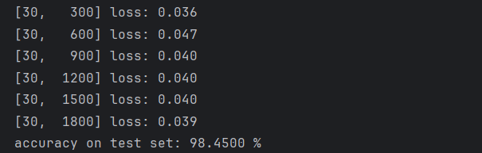

准确率达到了 98.45%，实验效果比较理想，不过仍有较大提升空间。

再观察这次测试30次迭代过程中accurary的变化趋势：

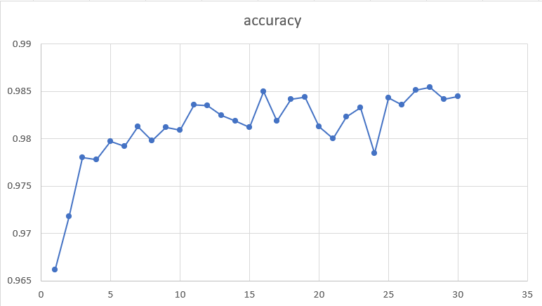

整体呈现上升趋势，随着迭代次数不断增加，上升的速度逐渐减小。

不过局部仍有波动，例如第24次迭代其accurary < 0.98，这个结果不是很理想，说明模型训练的稳定性仍不足。

2.对于基础版本的若干改进

2.1 调整参数

主要是对优化器的部分进行改进
```java
optimizer = optim.SGD(model.parameters(), lr=0.01, momentum=0.5, weight_decay=1e-3)
```
改变学习率lr为0.002，其它保持不变，测试结果如下：
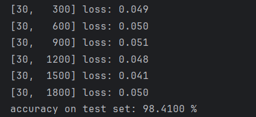

最后的结果差别不大，但是观察整个训练过程发现，开始时准确率较低：

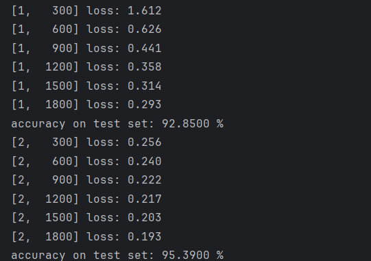

第一次迭代只有92.85%的准确率。

改变学习率lr为0.05，其它保持不变，测试结果如下：

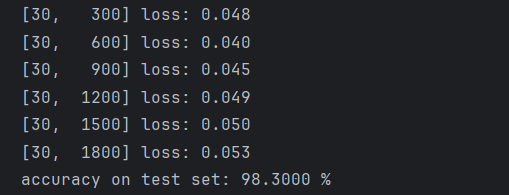

最后的结果差别同样不大，但是观察整个训练过程发现，开始时准确率较高：

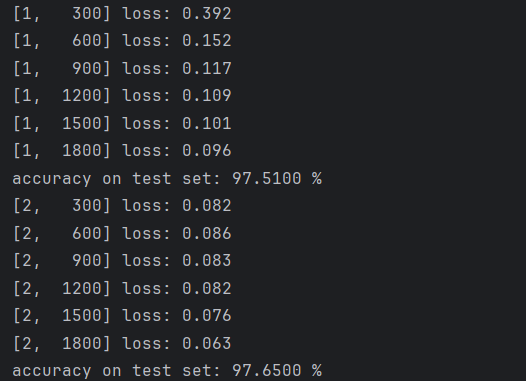

第一次迭代就可以达到97.51%的准确率。

通过上述尝试，发现学习率的高低对于最终结果的影响有限，主要影响迭代过程中的收敛速度。

接下来改变正则化项 weight_decay。

改变学习率weight_decay为1e-4，其它保持不变，测试结果如下：

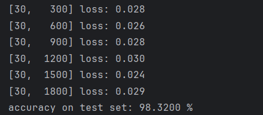

准确率为98.32%，与原始版本差别不大。

改变学习率weight_decay为1e-2，其它保持不变，测试结果如下：

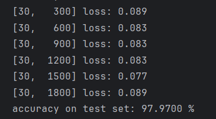

准确率为97.97%，较最初版本有所下降。

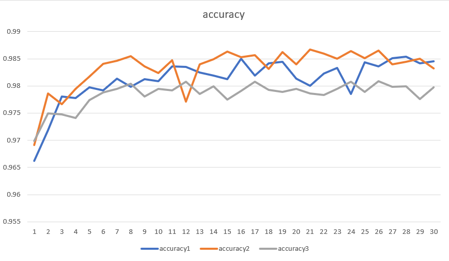

accuracy1表示weight_decay为1e-3的学习曲线，accuracy2表示weight_decay为1e-4的学习曲线，accuracy3表示weight_decay为1e-2的学习曲线，当weight_decay过大时确实会对模型的识别效果产生影响，导致欠拟合，而没有weight_decay正则化项也是不可取的，这样会导致模型过拟合，降低模型在测试集上的准确率。

2.2 改变神经网络的层数和结构

通过2.1的测试，采用lr = 0.01, weight_decay = 1e-4的optimizer来进行后续模型的训练和测试，以达到更好的效果。

我尝试通过增加模型的层数来达到更好的效果，具体的方法如下：将一个卷积层 + 一个池化层的网络增加到两个卷积层 + 两个池化层，使模型更好地提取图的有效信息，抛弃无效的干扰信息。

同时，增加全连接层的数量，在320（按照上述方法，通过卷积和池化得到的一个图像的表示向量长度） -> 10的过程中增加128和32两层，将320到10的过程有3个全连接层来完成，使得模型拥有更好的识别效果。

每两层中间使用relu激活函数及进行激活。

在这种情况下，神经网络类Net的代码修改如下：

```java
class Net(torch.nn.Module):
    def __init__(self):
        super(Net, self).__init__()
        self.conv1 = torch.nn.Conv2d(1, 10, kernel_size=5)
        self.pooling = torch.nn.MaxPool2d(2)
        self.conv2 = torch.nn.Conv2d(10, 20, kernel_size=5)
        self.fc1 = torch.nn.Linear(320, 128)
        self.fc2 = torch.nn.Linear(128, 32)
        self.fc3 = torch.nn.Linear(32, 10)

    def forward(self, x):
        batch_size = x.size(0)
        x = F.relu(self.pooling(self.conv1(x)))
        x = F.relu(self.pooling(self.conv2(x)))
        x = x.view(batch_size, -1)  # -1 此处自动算出的是320
        x = self.fc1(x)
        x = F.relu(x)
        x = self.fc2(x)
        x = F.relu(x)
        x = self.fc3(x)
        return x
```

其它部分保持不变，对这个程序进行测试，结果如下：

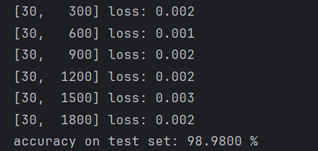

98.98%已经非常接近99%，而且在学习过程中，准确率一度达到了99.15%:


然后再将relu函数更换为leaky_relu，也就是x < 0部分有较小的斜率，在这种情况下，测试结果如图所示：

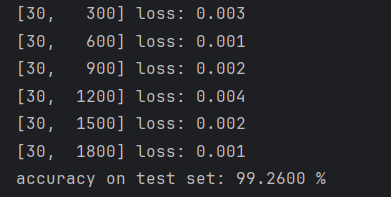

模型准确率高达99.26%，而且稳定性极佳，从第19次迭代之后始终高于99%，最高一次达到99.29%，也就是说在整个测试集10000个手写数字中只有71张识别错误。

这是在我多次尝试过程中效果最好的一个模型，接下来再总结一下这个模型的构成和学习过程：

模型的构成：
（1）卷积层，核大小为5，padding = 0，1通道到10通道；\
（2）池化层，二维2 * 2最大值池化；\
（3）激活函数层，采用leaky_relu作为激活函数；\
（4）卷积层，核大小为5，padding = 0，10通道到20通道；\
（5）池化层，二维2 * 2最大值池化；\
（6）激活函数层，采用leaky_relu作为激活函数；\
（7）全连接层，320 -> 128;\
（8）激活函数层，采用leaky_relu作为激活函数；\
（9）全连接层，128 -> 32;\
（10）激活函数层，采用leaky_relu作为激活函数；\
（11）全连接层，32 -> 10。

模型的学习过程：

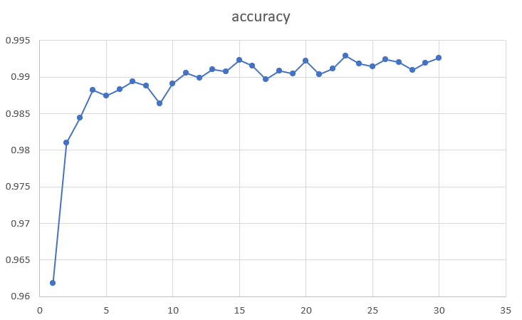

2.3 利用resnet进行改进 

ResNet，全称为残差网络（Residual Network），是一种深度学习架构，主要用于图像识别和分类任务。它由 Kaiming He 等人在 2015 年的论文《Deep Residual Learning for Image Recognition》中首次提出。ResNet 特别擅长处理非常深的神经网络，能够缓解深度神经网络训练中的梯度消失和梯度爆炸问题。

其主要特点包括：

· 残差学习：ResNet 的核心思想是引入了“残差学习”的概念。在传统的卷积神经网络中，每一层都试图直接学习输入和输出之间的映射关系。而在 ResNet 中，每一层不仅学习输入到输出的映射，还学习输入直接映射到输出的残差（即输入和输出之间的差异）。这种设计使得网络可以通过堆叠更多的层来增加深度，而不会损害训练性能。

· 残差块：ResNet 由多个残差块（Residual Blocks）组成，每个残差块包含两条路径：一条是卷积层的堆叠，另一条是输入的恒等映射（即直接将输入添加到卷积层的输出）。这两条路径的输出相加，形成残差块的最终输出。

· 深层网络：ResNet 能够实现非常深的网络结构，常见的有 ResNet-18、ResNet-34、ResNet-50、ResNet-101 和 ResNet-152 等变体，数字表示网络中的残差块数量。这些深层网络在图像识别任务中表现出色。

· 解决梯度问题：通过残差块的设计，ResNet 能够有效地解决深层网络训练中的梯度消失和梯度爆炸问题，使得训练更深的网络成为可能。

受限于笔记本电脑的运算能力，我没办法采用相当深的网络，只尝试了拥有8层网络的resnet，参数仍采用上述模型得到最优的参数，仍取得了比较好的识别效果。

一个basic_block的类如下定义：

```java
class Basicblock(nn.Module):
    def __init__(self, in_planes, planes, stride=1):
        super(Basicblock, self).__init__()
        self.conv1 = nn.Sequential(
            nn.Conv2d(in_channels=in_planes, out_channels=planes, kernel_size=3, stride=stride, padding=1, bias=False),
            nn.BatchNorm2d(planes),
            nn.ReLU()
        )
        self.conv2 = nn.Sequential(
            nn.Conv2d(in_channels=planes, out_channels=planes, kernel_size=3, stride=1, padding=1, bias=False),
            nn.BatchNorm2d(planes),
        )

        if stride != 1 or in_planes != planes:
            self.shortcut = nn.Sequential(
                nn.Conv2d(in_channels=in_planes, out_channels=planes, kernel_size=3, stride=stride, padding=1),
                nn.BatchNorm2d(planes)
            )
        else:
            self.shortcut = nn.Sequential()

    def forward(self, x):
        out = self.conv1(x)
        out = self.conv2(out)
        out += self.shortcut(x)
        out = F.relu(out)
        return out
```

out += self.shortcut(x)是resnet的核心，它使得每一个basic_block的输出中都有一个输入，也就是模型结果和输入的叠加，这样避免了梯度消失的问题，使得模型可以构建得非常深。

网络类基于basic_block类来构建，其具体的定义如下所示：

```java
class ResNet(nn.Module):
    def __init__(self, block, num_block, num_classes):
        super(ResNet, self).__init__()
        self.in_planes = 16
        self.conv1 = nn.Sequential(
            nn.Conv2d(in_channels=1, out_channels=16, kernel_size=3, stride=1, padding=1),
            nn.BatchNorm2d(16),
            nn.ReLU()
        )
        self.maxpool = nn.MaxPool2d(kernel_size=3, stride=1, padding=1)

        self.block1 = self._make_layer(block, 16, num_block[0], stride=1)
        self.block2 = self._make_layer(block, 32, num_block[1], stride=2)
        self.block3 = self._make_layer(block, 64, num_block[2], stride=2)

        self.outlayer = nn.Linear(64, num_classes)

    def _make_layer(self, block, planes, num_block, stride):
        layers = []
        for i in range(num_block):
            if i == 0:
                layers.append(block(self.in_planes, planes, stride))
            else:
                layers.append(block(planes, planes, 1))
        self.in_planes = planes
        return nn.Sequential(*layers)

    def forward(self, x):
        x = self.maxpool(self.conv1(x))
        x = self.block1(x)                 
        x = self.block2(x)             
        x = self.block3(x)             
        x = F.avg_pool2d(x, 7)     
        x = x.view(x.size(0), -1)             
        out = self.outlayer(x)
        return out
```

首先是一个卷积层和一个池化层，接下来是若干basic_block的结构block1，block2，block3，在初始化时通过参数指定每一个结构中包含的basic_block的数量。

_make_layer使得构造每一个结构中的若干basic_block的过程得以封装，操作更加简便。

采用这个模型进行测试，结果如下：

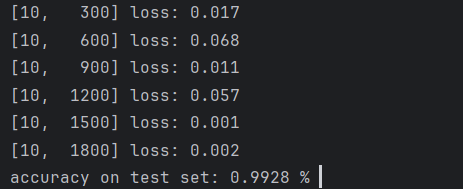

由于模型较为庞大，迭代速度比较缓慢，只采用epoch = 10进行训练，仍然达到了99.28%的准确率，体现出resnet的优越性。

迭代过程中准确率的变化趋势如下所示：

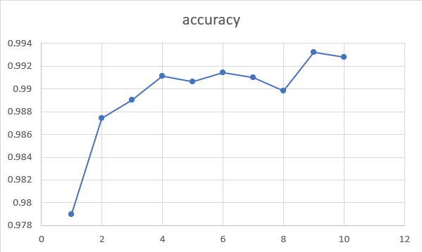

收敛速度快且训练过程较为稳定，是比较理想的模型。

### 三、实验过程

大部分的实验结果已经在第二部分中进行展示 ，这里再进行一个归纳：

|网络|学习率lr|正则化系数decay_weight|最后一次迭代准确率|
|:--:|:--:|:--:|:--:|
|一个卷积层 + 一个池化层|0.01|1e-3|98.45%|
|一个卷积层 + 一个池化层|0.002|1e-3|98.41%|
|一个卷积层 + 一个池化层|0.05|1e-3|98.30%|
|一个卷积层 + 一个池化层|0.01|1e-3|98.32%|
|一个卷积层 + 一个池化层|0.01|1e-3|97.97%|
|两个卷积层 + 两个池化层（relu）|0.01|1e-4|98.98%|
|两个卷积层 + 两个池化层（leaky_relu）|0.01|1e-4|99.26%|
|resnet（8层网络）|0.01|1e-4|__99.28%__|

此时我们利用plt来输出识别的错误的数字，会发现这些数字都是有歧义或者比较难以识别的，如下所示：


所以，模型对于正常手写数字的识别能力是比较理想的。

### 四、心得体会

通过这次的实验，我更加深入了了解了卷积神经网络的架构以及利用pytorch库书写深度神经网络的方法。

同时，我通过调参不断提高模型识别成功率的过程也颇有收获感，不仅了解了学习率，正则化系数等参数在模型中发挥的作用，也提高了自己训练模型的能力。

此外，我还通过加深网络和采用resnet架构等方式，试图获取更好的识别效果，结果也是比较理想的，这告诉我们，遇到问题时，要具体问题具体分析，在诸多的模型当中寻找最为合适的模型，这样才能取得最佳的效果。

总体来讲，本次的实验很有意义。感谢同组成员和助教老师的鼎力相助。


